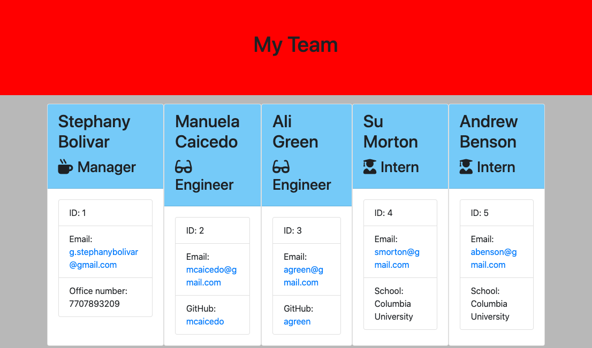

# Engineering Team Generator

## Description

As a manager
I want to generate a webpage that displays my team's basic info
so that I have quick access to emails and GitHub profiles

This is command link input (CLI) application. 

## **Table of Contents**

* [Installation](#installation)
* [Usage](#usage)
* [Contributing](#usage)
* [Test](#test)
* [Questions](#questions)
* [License](#license)

## Installation

Fork repository at [gstephbolivar github](https://github.com/gstephbolivar/engineering-team-generator) .

-npm install

-npm inquirer --save

-npm install jest

Happy Editing!

## Usage

This CLI application allows a manager to create a team html by following prompts and inputting their team information in the terminal. Then the information is generated into an output folder that holds the team html. Once opened in web browser, a user can see the managers team and some basic contact information for that team member.

## Contributing

A user can contribute by creating more styling to the html documents to allow the webpage to be more user friendly and professional. Also, a user can contribute by color coding the prompts to allow the user an easier view and input experience.

## Test

[YouTubeDemo](https://www.youtube.com/watch?v=Dwb10482duM&feature=youtu.be)

## Credits

I credit the following people and websites for assistance on this application:

[Robert] (https://github.com/reanderson89)

[Brian] (https://github.com/bcshanken)

[Neil] (https://github.com/ntch2000)

[MozillaDeveloper] (https://developer.mozilla.org/en-US/docs/Web/JavaScript/Reference/Classes)

[NPMJS] (https://www.npmjs.com/package/inquirer)

[TAONPM] (https://developer.aliyun.com/mirror/npm/package/inquirer-confirm-validated)

[MozillaDeveloper] (https://developer.mozilla.org/en-US/docs/Web/JavaScript/Reference/Global_Objects/null)

## Questions

####  **Stephany Bolivar** 
*  **Github:** [@gstephbolivar](https://github.com/gstephbolivar)
*  **Email:** [g.stephanybolivar@gmail.com](g.stephanybolivar@gmail.com)

## License

MIT License

Copyright (c) [2020] [Gloria Stephany Bolivar]

Permission is hereby granted, free of charge, to any person obtaining a copy
of this software and associated documentation files (the "Software"), to deal
in the Software without restriction, including without limitation the rights
to use, copy, modify, merge, publish, distribute, sublicense, and/or sell
copies of the Software, and to permit persons to whom the Software is
furnished to do so, subject to the following conditions:

The above copyright notice and this permission notice shall be included in all
copies or substantial portions of the Software.

THE SOFTWARE IS PROVIDED "AS IS", WITHOUT WARRANTY OF ANY KIND, EXPRESS OR
IMPLIED, INCLUDING BUT NOT LIMITED TO THE WARRANTIES OF MERCHANTABILITY,
FITNESS FOR A PARTICULAR PURPOSE AND NONINFRINGEMENT. IN NO EVENT SHALL THE
AUTHORS OR COPYRIGHT HOLDERS BE LIABLE FOR ANY CLAIM, DAMAGES OR OTHER
LIABILITY, WHETHER IN AN ACTION OF CONTRACT, TORT OR OTHERWISE, ARISING FROM,
OUT OF OR IN CONNECTION WITH THE SOFTWARE OR THE USE OR OTHER DEALINGS IN THE
SOFTWARE.